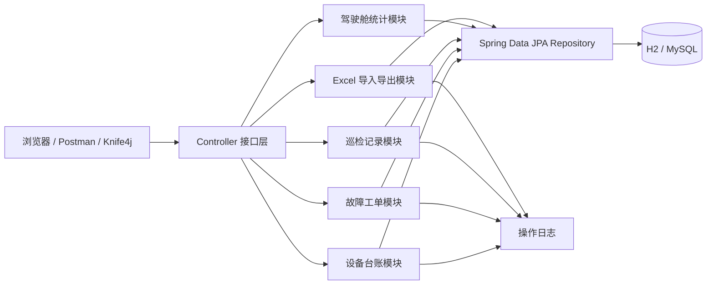

# 交通信息化工单与设备台账系统

这是一个基于 Spring Boot 的交通信息化后端接口系统，围绕高速路段设备台账、巡检记录、故障工单和运维统计等场景展开。项目模拟运营商政企/DICT 项目中常见的行业客户信息化需求：为交通、政务、园区等客户提供设备台账、工单流转、数据统计和 Excel 台账处理等后端能力。

项目提供 REST 接口、接口文档、演示数据、Excel 导入导出和自动化测试，方便在本地快速运行和演示。


## 项目背景

在运营商政企业务、DICT 集成交付和行业信息化项目中，经常会遇到这类需求：客户现场有大量摄像头、传感器、信息发布屏、网关等设备，需要一套系统记录设备台账、巡检情况、故障工单和统计报表。

本项目选取“交通信息化运维”作为业务切入点，模拟一个较小但完整的后端服务：

- 客户对象：高速公路、政务交通、园区运维等信息化场景。
- 业务对象：路段、设备、巡检、故障工单、操作日志。
- 常见动作：设备查询、新增设备、状态更新、巡检记录、工单处理、Excel 导入导出。
- 交付支撑：接口文档、演示数据、测试用例、MySQL 配置。

## 项目能做什么

- 路段基础数据：维护高速路段名称、编码、区域、里程。
- 设备台账：管理摄像头、传感器、信息发布屏等设备资产。
- 巡检记录：记录设备巡检人、巡检时间、巡检结果和备注。
- 故障工单：记录设备故障、优先级、报修人和处理状态。
- 操作日志：记录新增设备、更新状态、导入 Excel 等关键操作。
- 驾驶舱统计：统计设备状态、工单状态、路段数量、设备数量。
- Excel 导入导出：设备台账支持导出为 Excel，也支持按资产编号导入新增/更新。
- Swagger/Knife4j 文档：启动后可直接在网页上查看和调试接口。

## 实际怎么使用

可以把它理解成一个“小型交通运维后台”的后端服务。前端页面、Postman 或 Knife4j 都可以调用这些接口，完成设备台账管理、巡检记录、故障工单流转和统计查询。

典型使用流程：

1. 基础数据准备：系统里先有银川、石嘴山、中卫等高速路段数据。
2. 录入设备台账：把摄像头、传感器、信息发布屏等设备录入系统，也可以用 Excel 批量导入。
3. 日常巡检：运维人员巡检设备后，提交巡检记录，比如画面是否清晰、传感器数据是否正常。
4. 发现故障：如果设备异常，就创建故障工单，写清楚故障描述和优先级。
5. 工单流转：值班人员把工单从待处理改为处理中、已解决或已关闭。
6. 统计查看：管理人员打开统计接口，看设备总数、告警设备数、未处理工单数。
7. 台账导出：需要汇报或交接时，把设备台账导出成 Excel。

## 本地演示路径

启动项目后，可以按下面顺序在 Knife4j 中演示完整流程：

1. `GET /api/dashboard`：查看设备、路段、工单统计。
2. `GET /api/road-sections`：查看路段基础数据和路段编码。
3. `GET /api/devices`：查看设备台账。
4. `POST /api/devices`：新增一台设备。
5. `POST /api/tickets`：针对某台设备创建故障工单。
6. `PATCH /api/tickets/{id}/status`：更新工单处理状态。
7. `GET /api/devices/export`：导出设备台账 Excel。
8. `POST /api/devices/import`：导入设备台账 Excel，按资产编号新增或更新。

## 和运营商政企/DICT场景的关系

这个项目重点对应运营商政企方向常见的几类能力：

- 行业客户业务理解：围绕交通、政务、园区等客户的设备管理和运维工单展开。
- 接口联调能力：使用 REST API 和 Knife4j 文档，便于前后端、测试、实施人员协同。
- 数据台账处理：支持设备台账查询、状态维护、Excel 导入导出。
- 项目交付演示：默认 H2 数据库可直接运行，也提供 MySQL 配置用于接近真实部署。
- 运维支撑意识：有健康检查、操作日志、状态统计和自动化测试。

后续如果继续扩展，可以加入用户角色、工单派发、附件上传、短信/邮件通知、设备告警接入、前端管理页面等功能。

## 项目边界

当前版本聚焦后端接口服务和本地演示能力，暂未包含前端管理页面、真实设备协议接入、统一认证、短信网关和生产环境部署脚本。系统默认使用内存数据库 H2，便于快速启动；如需接近实际部署，可切换到 MySQL profile。

## 系统模块图



## 技术栈

- Java 21
- Spring Boot 3.5.7
- Spring Web MVC
- Spring Data JPA
- Bean Validation
- H2 内存数据库，默认开箱即用
- MySQL 运行配置
- Apache POI，处理 Excel 导入导出
- springdoc-openapi + Knife4j，生成接口文档
- JUnit 5 + MockMvc，做接口测试

## 本地启动

推荐先用默认 H2 方式启动，不需要提前装数据库。

```powershell
cd C:\Users\cbx\Documents\work1\traffic-ops-workbench
C:\Users\cbx\Tools\apache-maven-3.9.16\bin\mvn.cmd spring-boot:run
```

也可以用项目自带脚本：

```powershell
.\mvnw.cmd spring-boot:run
```

启动成功后打开：

- Knife4j 接口文档：[http://localhost:8080/doc.html](http://localhost:8080/doc.html)
- Swagger UI：[http://localhost:8080/swagger-ui.html](http://localhost:8080/swagger-ui.html)
- OpenAPI JSON：[http://localhost:8080/v3/api-docs](http://localhost:8080/v3/api-docs)
- 健康检查：[http://localhost:8080/api/health](http://localhost:8080/api/health)
- H2 控制台：[http://localhost:8080/h2-console](http://localhost:8080/h2-console)

H2 控制台连接信息：

```text
JDBC URL: jdbc:h2:mem:traffic_ops
User Name: sa
Password: 留空
```

## MySQL 版本运行

如果要切到 MySQL，可以先建库：

```sql
CREATE DATABASE traffic_ops_workbench DEFAULT CHARACTER SET utf8mb4 COLLATE utf8mb4_unicode_ci;
```

PowerShell 示例：

```powershell
$env:MYSQL_URL="jdbc:mysql://localhost:3306/traffic_ops_workbench?useUnicode=true&characterEncoding=utf8&serverTimezone=Asia/Shanghai&allowPublicKeyRetrieval=true&useSSL=false"
$env:MYSQL_USERNAME="root"
$env:MYSQL_PASSWORD="你的密码"
C:\Users\cbx\Tools\apache-maven-3.9.16\bin\mvn.cmd spring-boot:run "-Dspring-boot.run.profiles=mysql"
```

MySQL 配置文件在 `src/main/resources/application-mysql.yml`。默认运行仍然使用 H2，方便本地快速启动。

## 接口示例

接口字段名采用后端常见英文命名，接口文档里补了中文说明。例如 `assetCode` 表示“资产编号”，`roadSectionId` 表示“所属路段 ID”，`installedAt` 表示“安装日期”。

健康检查：

```http
GET /api/health
```

返回示例：

```json
{
  "success": true,
  "data": {
    "service": "traffic-ops-workbench",
    "status": "UP"
  },
  "message": "ok",
  "timestamp": "2026-05-30T02:10:50"
}
```

查询设备台账：

```http
GET /api/devices?status=ONLINE
```

新增设备：

```http
POST /api/devices
Content-Type: application/json
```

```json
{
  "name": "收费站入口抓拍摄像机",
  "assetCode": "CAM-YC-009",
  "deviceType": "Camera",
  "status": "ONLINE",
  "roadSectionId": 1,
  "location": "银川北收费站入口车道",
  "installedAt": "2025-03-01"
}
```

更新设备状态：

```http
PATCH /api/devices/1/status
Content-Type: application/json
```

```json
{
  "status": "MAINTENANCE",
  "operator": "运维值班员"
}
```

新建故障工单：

```http
POST /api/tickets
Content-Type: application/json
```

```json
{
  "deviceId": 2,
  "title": "传感器采集数据波动",
  "description": "夜间采集值波动较大，需要复核采集链路和供电情况。",
  "priority": "HIGH",
  "reporter": "调度中心"
}
```

导出设备台账 Excel：

```http
GET /api/devices/export
```

导入设备台账 Excel：

```powershell
curl.exe -F "file=@C:\Users\cbx\Desktop\devices.xlsx" http://localhost:8080/api/devices/import
```

Excel 表头顺序：

```text
设备名称, 资产编号, 设备类型, 状态, 路段编码, 路段名称, 区域, 安装位置, 安装日期
```

其中 `状态` 可填：`ONLINE`、`WARNING`、`OFFLINE`、`MAINTENANCE`、`FAULT`。`路段编码` 可先通过 `GET /api/road-sections` 查询。

## 主要接口

| 方法 | 路径 | 说明 |
| --- | --- | --- |
| GET | `/api/health` | 健康检查 |
| GET | `/api/dashboard` | 首页统计 |
| GET | `/api/road-sections` | 路段列表 |
| GET | `/api/devices` | 查询设备台账 |
| POST | `/api/devices` | 新增设备 |
| PATCH | `/api/devices/{id}/status` | 更新设备状态 |
| GET | `/api/devices/export` | 导出设备 Excel |
| POST | `/api/devices/import` | 导入设备 Excel |
| GET | `/api/tickets` | 查询故障工单 |
| POST | `/api/tickets` | 新建故障工单 |
| PATCH | `/api/tickets/{id}/status` | 更新工单状态 |
| GET | `/api/inspections` | 查询巡检记录 |
| POST | `/api/inspections` | 新增巡检记录 |
| GET | `/api/operation-logs` | 查询操作日志 |

## 测试说明

运行测试：

```powershell
C:\Users\cbx\Tools\apache-maven-3.9.16\bin\mvn.cmd test
```

当前测试覆盖：

- Spring Boot 上下文启动
- 健康检查接口
- 路段基础数据接口
- 设备台账查询接口
- 设备台账 Excel 导出
- 设备台账 Excel 导入并查询
- OpenAPI 接口文档生成
